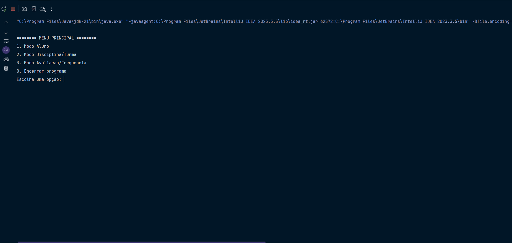
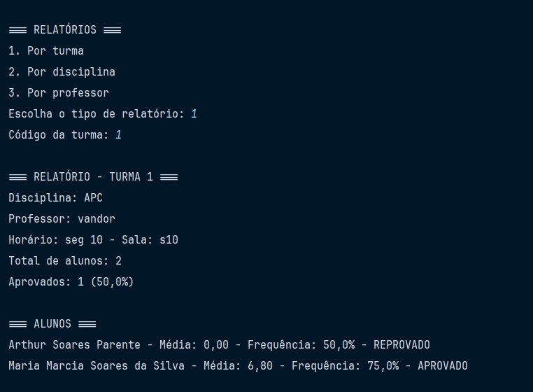
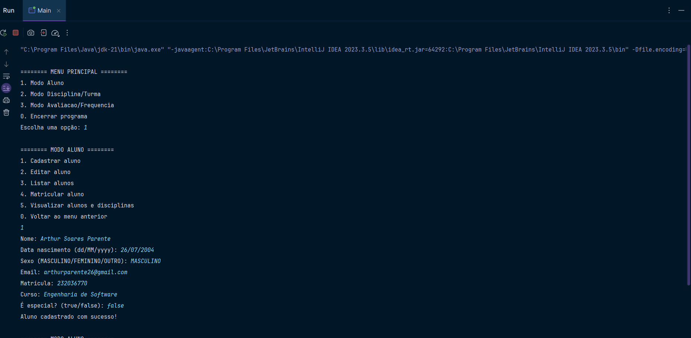

# Sistema Acadêmico - FCTE

## Descrição do Projeto

Desenvolvimento de um sistema acadêmico para gerenciar alunos, disciplinas, professores, turmas, avaliações e frequência, utilizando os conceitos de orientação a objetos (herança, polimorfismo e encapsulamento) e persistência de dados em arquivos.

O enunciado do trabalho pode ser encontrado aqui:
- [Trabalho 1 - Sistema Acadêmico](https://github.com/lboaventura25/OO-T06_2025.1_UnB_FCTE/blob/main/trabalhos/ep1/README.md)

## Dados do Aluno

- **Nome completo:** [Arthur Soares Parente]
- **Matrícula:** [232036770]
- **Curso:** [Engenharia de Software]
- **Turma:** [Orientação a objetos turma 06]

---

## Instruções para Compilação e Execução

1. **Compilação:**  
   [Clonar repositorio na ide de preferencia e executar a classe Main, no desenvolvimento foi utilizado o InteliJ]

2. **Execução:**  
   [Executar classe Main.java na raiz]

3. **Estrutura de Pastas:**  

3. **Versão do JAVA utilizada:**  
   [Java 21]

---

## Vídeo de Demonstração

- [Inserir o link para o vídeo no YouTube/Drive aqui]

---

## Prints da Execução

1. Menu Principal:  
   

2. Cadastro de Aluno:  
   

3. Relatório de Frequência/Notas:  
   

---

## Principais Funcionalidades Implementadas

- [x] Cadastro, listagem, matrícula e trancamento de alunos (Normais e Especiais)
- [x] Cadastro de disciplinas e criação de turmas (presenciais e remotas)
- [x] Matrícula de alunos em turmas, respeitando vagas e pré-requisitos
- [x] Lançamento de notas e controle de presença
- [x] Cálculo de média final e verificação de aprovação/reprovação
- [x] Relatórios de desempenho acadêmico por aluno, turma e disciplina
- [x] Persistência de dados em arquivos (.txt ou .csv)
- [x] Tratamento de duplicidade de matrículas
- [x] Uso de herança, polimorfismo e encapsulamento

---

## Observações (Extras ou Dificuldades)

- [Validação dos campos, uso de abstracao e associação e enums além de separar as logicas para salvar os dados em arquivo. Tive dificuldade principalmente na implementação do salvamento de arquivos]

---

## Contato

- [Opcional: arthurparente26@gmail.com.]
